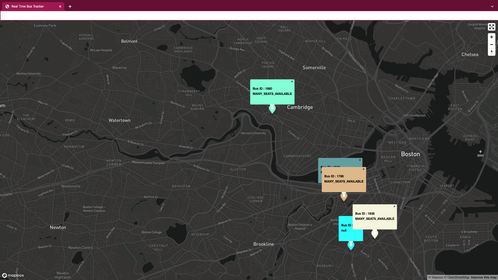

<h1 align="center">Real Time Bus Tracker</h1>

<h4 align="center">Creating a Real Time Bus Tracker using mapbox with data from MBTA</h4>
 

 

### Description 

- A real time bus tracker for MBTA (Massachusetts Bay Transportation Authority) route 1 Harvard Square - Nubian Station.

- This project uses mapbox, an open-source platform that allows us to create and display maps on a web page. 
  
- The mapboxgl JavaScript library helps add customizations to map with controls for fullscreen access, zoom and rotation.

- Data from MBTA route 1 is pulled from MBTA via APIs.

- Popups provide bus id and seat availability and can be closed if needed.

### To Run this Program

In order to run this file, Fork and Clone the repository to your local machine and open the index.html file in a browser.

### Future RoadMap 

- This project can be still be enhanced by adding directionality of the bus.

- In the near future, I am planning on creating a real time train map for my zipcode.
  
### License

This exercise stems from MIT xPRO Professional Certificate in Coding: Full Stack Development with MERN Program

> MIT License
> Copyright (c) 2022 Sujatha Arunagiri
> Permission is hereby granted, free of charge, to any person obtaining a copy
> of this software and associated documentation files (the "Software"), to deal
> in the Software without restriction, including without limitation the rights
> to use, copy, modify, merge, publish, distribute, sublicense, and/or sell
> copies of the Software, and to permit persons to whom the Software is
> furnished to do so, subject to the following conditions:
> The above copyright notice and this permission notice shall be included in all
> copies or substantial portions of the Software.
> THE SOFTWARE IS PROVIDED "AS IS", WITHOUT WARRANTY OF ANY KIND, EXPRESS OR
> IMPLIED, INCLUDING BUT NOT LIMITED TO THE WARRANTIES OF MERCHANTABILITY,
> FITNESS FOR A PARTICULAR PURPOSE AND NONINFRINGEMENT. IN NO EVENT SHALL THE
> AUTHORS OR COPYRIGHT HOLDERS BE LIABLE FOR ANY CLAIM, DAMAGES OR OTHER
> LIABILITY, WHETHER IN AN ACTION OF CONTRACT, TORT OR OTHERWISE, ARISING FROM,
> OUT OF OR IN CONNECTION WITH THE SOFTWARE OR THE USE OR OTHER DEALINGS IN THE
> SOFTWARE.
